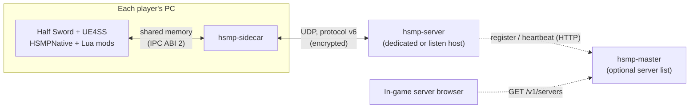

# HalfSword-MP

[](https://github.com/Cyrex0/HalfSword-MP/actions/workflows/ci.yml)
[](#license)

**An unofficial multiplayer mod for [Half Sword](https://store.steampowered.com/app/2397300/).**
Players fight each other online in Half Sword's arenas with the game's own bodies, weapons, armour
and damage. A Rust server runs the match; a native UE4SS module and a set of Lua mods connect each
game to it.

> **Not affiliated with Half Sword Games.** HalfSword-MP (HSMP) is a fan-made project. It is not
> affiliated with, endorsed by, or supported by Half Sword Games or its publisher. "Half Sword" is a
> trademark of its owner and is used only to say which game this mod is for. Please do not report
> HSMP bugs to the Half Sword developers. HSMP ships no game code or assets: you need your own copy
> of Half Sword on Steam.
>
> **Use at your own risk.** HSMP installs the UE4SS mod loader and changes local game files (a
> `dwmapi.dll` loader, the `ue4ss\` folder, one `Engine.ini` line). It backs up your career save and
> diverts it during a session. Back up `%LOCALAPPDATA%\HalfSwordUE5\Saved\SaveGames` first. The
> launcher's Uninstall restores everything it changed. Half Sword has no anti-cheat, and HSMP does
> not touch Steam achievements or stats.

## Contents

- [What it is](#what-it-is)
- [Features](#features)
- [Status and known issues](#status-and-known-issues)
- [Requirements](#requirements)
- [Install](#install)
- [Host and join](#host-and-join)
- [Dedicated server quick start](#dedicated-server-quick-start)
- [Build from source](#build-from-source)
- [How it works](#how-it-works)
- [Project layout](#project-layout)
- [Contributing](#contributing)
- [License](#license)

## What it is

Half Sword is a single-player game. HSMP adds player-versus-player matches for up to 8 players,
hosted from the in-game menu or on a dedicated server. Each player runs the normal game with HSMP
installed. Other players appear as real Half Sword fighters, driven by physics from their streamed
poses, and hits between players go through the game's own damage code.

## Features

- **Matches**: lobby, ready-up, arena pick, best-of-N rounds, round reset and match result. The
  server is authoritative over the map, the mode and the match flow; clients only follow it.
- **Full-body replication**: each player's root, 16-bone pose and held weapon are sampled every
  frame, streamed, and played back on physics stand-ins through a jitter buffer sized for internet
  links.
- **Combat parity with single-player**: a hit is replayed natively on the victim's game through
  Half Sword's own damage path, with the same hit effects, blood and gore. The server validates
  every damage claim with lag compensation (rewind, swept blades, block and clash adjudication) and
  per-player limits.
- **Vitals and world**: health, limbs, stamina, bleeding, falls and dismemberment are kept in sync,
  and weapons and props in the arena are shared between players.
- **Loadouts and classes**: pick a class or build a kit from the game's weapons and armour, within
  the host's rules.
- **In-game menus**: Half Sword's main menu gets HOST GAME, SERVER BROWSER, SETTINGS and CHARACTER.
  The server browser lists LAN servers and servers from a master server list, and has DIRECT
  CONNECT for `ip:port`.
- **HUD**: every fighter's CON (consciousness), BODY % (weighted body health) and BLEED, plus
  stamina, the round state and the score.
- **UI scaling**: every HSMP menu and HUD element scales from one 1920x1080 design to the window
  size and DPI, including 4:3 and ultrawide screens (no stretching).
- **Admins by player key**: on a dedicated server, admins are named by their player key; a listen
  host is the owner of its own server. Nobody becomes admin by joining first.
- **Dedicated server** for Windows and Linux (no game needed), with Docker, RCON, a ban list and an
  optional self-hosted server list (`hsmp-master`).
- **Encrypted transport (protocol v6)**: X25519 key exchange, ChaCha20-Poly1305, stateless
  cookies and a per-install Ed25519 player identity.
- **Shared-memory IPC**: the game and its local sidecar exchange state through one shared-memory
  segment (IPC ABI 2) instead of files. Pose sampling and the stand-in servo run in the native
  module, off the Lua hot path.
- **Crash guards**: the round reset waits for the game's Runtime Vertex Paint (blood painting)
  queue to drain before it reloads the arena, which prevents a use-after-free crash in the engine
  plugin. The launcher also applies a known workaround for a pak-streaming crash.
- **Career-save protection**: your single-player progress is backed up before a session and
  restored after it.
- **A launcher** that checks your game build, installs and removes the signed release
  byte-exactly, and backs up your saves.

## Status and known issues

HSMP is in **beta (0.1.x)**. It works for groups of friends on a LAN or over the internet, and it
is still changing quickly.

| Area | State |
|---|---|
| Duel-style matches, 2 to 8 players | Works |
| Join from the server list, the LAN list or by DIRECT CONNECT `ip:port` | Works |
| Hosting from the in-game menu (listen server) | Works; forward the UDP port for internet play |
| Dedicated server (Windows, Linux, Docker) | Works |
| Public internet server list | Works: `https://master.halfswordmp.workers.dev`, with signed listings |
| Game modes other than duel (FFA, teams, zone) | Written and tested, **not wired into the server yet** |
| NAT traversal | Not shipped: the host must forward the port |
| Voice chat | Not shipped |
| More than 8 players | Not supported |

Supported game build: Half Sword Steam build 24185754 (UE 5.4.4). HSMP runs on the RE-UE4SS
experimental build at commit `e3ba1016` ([details](docs/development/ue4ss.md)). The launcher refuses
other game builds until HSMP is updated for them.

### Known issues

- **Remote players can look less precise on heavy maps.** When the game's frame time is high, a
  remote fighter's arms and blade can trail or overshoot their real position, and feet can slide.
  Hits are still judged on the server's data, but what you see may not match it exactly.
- **A player is occasionally knocked down or nudged at round start.** In rare rounds a fighter
  spawns slightly off its spawn point, falls, or has to re-arm right after the round begins.
- Without a named admin, a dedicated server's lobby starts the match by itself when every player is
  ready. See [admins](docs/hosting/dedicated-server.md).
- One unexpected server error can stop the dedicated server. Run it under a service manager that
  restarts it (systemd, NSSM, Docker `--restart`).
- Some developer hotkeys are still active in the release build.

See [troubleshooting](docs/players/troubleshooting.md) for fixes to common problems.

## Requirements

- Windows 10 or 11, 64-bit.
- Half Sword on Steam, at the supported build.
- For internet hosting: a UDP port forwarded to your PC (7777 by default).
- A dedicated server needs no game: Windows, Linux or Docker.

## Install

1. Download the latest `hsmp-<version>.zip` from the
   [Releases page](https://github.com/Cyrex0/HalfSword-MP/releases) and check its SHA-256 against
   the one on the release page.
2. Unzip it anywhere and run `hsmp-launcher.exe`. Windows SmartScreen may warn about an unsigned
   program: choose **More info**, then **Run anyway**.
3. The launcher finds Half Sword, checks the game build and backs up your saves. Click **Install**.
4. Click **Launch through Steam** (recommended: it applies the crash workaround), or start Half Sword
   from Steam directly. Its main menu now shows the HSMP buttons next to the game's own.

The launcher checks GitHub for a new HSMP release each time it opens and installs it with one click.
To remove HSMP, click **Uninstall** in the launcher. Full guides: [install](docs/players/install.md),
[career saves](docs/players/career-saves.md), [uninstall](docs/players/uninstall.md),
[FAQ](docs/players/faq.md).

## Host and join

- **Join:** open SERVER BROWSER. Internet servers from the public server list and servers on your
  LAN appear on their own; you can also type a server's `ip:port` into DIRECT CONNECT.
- **Host:** click HOST GAME. Your PC starts a server and you land in its lobby, as its owner
  (admin): you pick the arena and start the match. Friends on the internet need you to forward
  the UDP host port (7777 by default) on your router; LAN players can join directly.
- In the lobby, choose a class or a loadout and ready up. Once everyone is ready, the host (or an
  admin) starts the match; a dedicated server without an admin starts it by itself.

More in [playing](docs/players/playing.md).

## Dedicated server quick start

The dedicated server is one program, `hsmp-server`. It does not need the game.

| Port | Protocol | Purpose |
|---|---|---|
| 7777 | UDP | Game traffic (open this one) |
| 7778 | TCP | `hsmp-master` server list (only if you run one) |
| 2345 | TCP | RCON, **loopback only** by default: reach it through an SSH tunnel |

Docker (any OS):

```sh
docker build -t hsmp-server .
docker run -d --name hsmp --restart unless-stopped \
  -p 7777:7777/udp -v hsmp-data:/hsmp/data hsmp-server
```

Linux from source:

```sh
cargo build --release --locked -p hsmp-server
./target/release/hsmp-server --bind 0.0.0.0:7777 --name "My server" --admin-key <your player key>
```

Windows: `.\scripts\run-dedicated-server.ps1 -BinDir <folder with hsmp-server.exe>`, or install it
as a service with `.\scripts\install-service.ps1`.

**Admins.** Get your player key on your gaming PC with `hsmp-sidecar --print-player-key`, then pass
it with `--admin-key` (repeatable), list keys in a file with `--admins-file`, or add one at runtime
with the RCON command `ADMIN ADD`. Admins can kick, ban and change the map from the in-game menu.

**RCON.** `--rcon-bind 127.0.0.1:2345 --rcon-password <password>` (or `HSMP_RCON_PASSWORD`). A
non-loopback address is refused unless `--rcon-allow-remote` is also given with a password of at
least 16 characters; RCON is plain text, so prefer an SSH tunnel.

The server's identity key (`server_identity.key` in `HSMP_STATE_DIR`) is what clients remember the
server by: keep it and back it up. More in the [hosting docs](docs/hosting/dedicated-server.md):
[ports and firewall](docs/hosting/ports-and-firewall.md), [configuration](docs/hosting/configuration.md),
[RCON](docs/hosting/rcon.md), [Docker](docs/hosting/docker.md), [Linux](docs/hosting/linux.md),
[master server](docs/hosting/master-server.md).

## Build from source

**Prerequisites**

- [rustup](https://rustup.rs/). The toolchain (Rust 1.98.1) is pinned in `rust-toolchain.toml`;
  rustup selects it inside the repository.
- Windows: Visual Studio Build Tools with the "Desktop development with C++" workload (the native
  module and the vendored Lua used by the test harnesses are compiled from C/C++). Linux: a C
  compiler (`build-essential`); only the server side builds on Linux.
- [Git for Windows](https://git-scm.com/): its Git Bash runs `scripts/e2e-test.sh`.
- Optional, for in-game testing: Half Sword with UE4SS installed, at `<repo>/game` or wherever
  `HSMP_GAME_DIR` points.

There is no Python anywhere in the project: tooling and tests are Rust (or C++), mod code is Lua,
host scripts are PowerShell or POSIX shell.

**Build and test**

```sh
cargo build --release --locked --workspace     # everything; binaries in target/release
cargo test --workspace --locked                # every Rust test and the Lua harnesses
target/release/hsmp-gate g0                    # the G0 gate: lints, Lua suites, schema, tests
```

Without the game installed, the G0 checks that need the game's UE4SS object dump report `SKIP`
instead of failing. End-to-end tests run the real server, sidecars and master over UDP and HTTP
(Git Bash on Windows, no game needed):

```sh
cargo build --release --locked -p hsmp-server -p hsmp-tools
HSMP_TOOLS=$PWD/target/release/hsmp-tools.exe HSMP_BINS=$PWD/target/release bash scripts/e2e-test.sh
```

To try a build in your own game, `scripts/build-and-deploy.ps1` builds the binaries and copies the
mods into the game folder (`-Dev` adds the developer mods, `-DryRun` shows what it would do). See
[CONTRIBUTING.md](CONTRIBUTING.md), [testing](docs/development/testing.md) and
[tools](docs/development/tools.md).

## How it works



- **Lua mods** (`mods/`) run inside the game under UE4SS. They read the game's state, drive the
  stand-ins for other players, replay remote hits, and show the menus and HUD. The Director in
  `HSMPMatch` is the only code that changes levels, and only when the server says so.
- **HSMPNative** (`crates/hsmp-native`) is a native UE4SS Lua module. It maps the shared-memory
  segment, exposes typed records, rings and a game-local bus to Lua, and runs pose sampling and
  the stand-in servo natively.
- **hsmp-sidecar** runs next to each game, attaches to the segment (`--ipc shm:<name>`) and bridges
  it to the network.
- **hsmp-server** is the authoritative match server: sessions, seats, map and mode, rounds,
  damage validation and relay.
- **hsmp-master** is an optional HTTP server list.
- **hsmp-launcher** installs, verifies, updates and removes the signed release.

Details: [architecture](docs/development/architecture.md), [wire protocol](docs/development/protocol.md),
[shared-memory IPC](docs/development/ipc-shared-memory.md), [server modules](docs/development/server-modules.md),
[Lua mod guide](docs/development/lua-mods.md), [round-reset crash guard](docs/development/crash-rr.md).

## Project layout

```
.
├── Cargo.toml, Cargo.lock      the Cargo workspace (one lock file)
├── rust-toolchain.toml         the pinned Rust toolchain
├── server/                     hsmp-server, hsmp-sidecar, hsmp-master, hsmp-loadtest, hsmp-query
├── launcher/                   hsmp-launcher (player installer and launcher)
├── crates/
│   ├── hsmp-net/               protocol v6: handshake, connections, channels, messages
│   ├── hsmp-ipc/               shared-memory IPC: segment schema, primitives, code generators
│   ├── hsmp-native/            HSMPNative, the in-game native module (Rust + C++)
│   ├── hsmp-pose/              pose codec, sample encoder and the receiver jitter buffer
│   ├── hsmp-modes/             game-mode framework (not wired into the server yet)
│   └── hsmp-combat-sim/        deterministic combat simulator over the real server code
├── mods/                       UE4SS Lua mods that ship (<Mod>/Scripts/main.lua)
│   ├── shared/                 libraries copied into every mod at deploy
│   ├── dev/                    developer-only mods
│   └── mods.release.txt        the mods.txt template (which mods are enabled)
├── tools/
│   ├── hsmp-tools/             developer CLI, the hsmp-gate test gate, lints, Lua test harness
│   ├── release/                hsmp-release: signed, reproducible release packages
│   ├── pose-truth/             pose ground-truth probe
│   └── mapdump/                extracts map data from the game's pak (C#)
├── tests/                      offline Lua test harnesses (Rust + mlua)
├── scripts/                    deploy, e2e tests, in-game gate, server host scripts
├── experimental/               spikes and probes that do not ship
├── bench/                      IPC benchmark results
├── docs/                       players/, hosting/, development/ (index: docs/README.md)
└── Dockerfile                  dedicated-server image
```

## Contributing

Contributions are welcome. Read [CONTRIBUTING.md](CONTRIBUTING.md) first: it covers the
prerequisites, the pre-push gate, the rules for Lua mods that keep the game from crashing, and the
pull-request flow. Report security problems privately as described in [SECURITY.md](SECURITY.md).
Changes are listed in [CHANGELOG.md](CHANGELOG.md). The documentation index is
[docs/README.md](docs/README.md).

## License

Licensed under either of [Apache License 2.0](LICENSE-APACHE) or [MIT](LICENSE-MIT), at your
option. Unless you explicitly state otherwise, any contribution you submit is dual-licensed as
above, without additional terms. Third-party components and their licences are listed in
[NOTICE](NOTICE) and, for releases, in `THIRD-PARTY-NOTICES.html`.

## Credits

- [UE4SS](https://github.com/UE4SS-RE/RE-UE4SS) (MIT): the mod loader HSMP runs on.
- [massclown](https://github.com/massclown)'s Half Sword mods (MIT): prior art that showed what was
  possible.
- [Half Sword](https://store.steampowered.com/app/2397300/) by Half Sword Games: go buy it.
