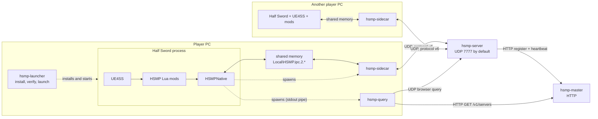
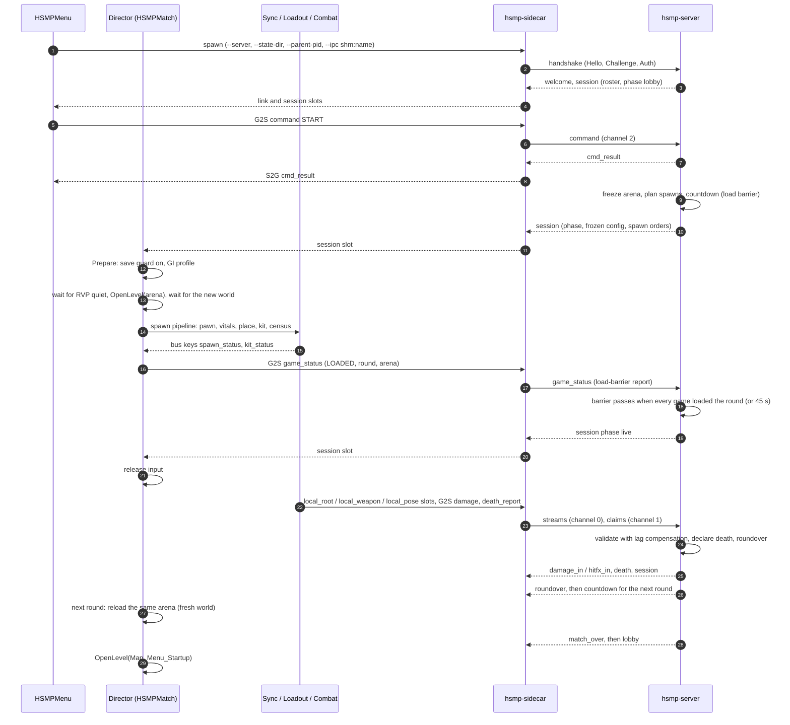
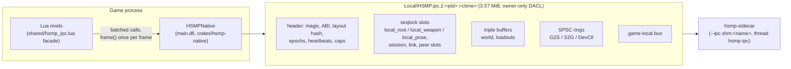

# HalfSword-MP architecture

How the pieces of HalfSword-MP (HSMP) fit together, for someone about to change the code. Where a
subsystem has its own design note, this page links to it instead of repeating it.

Related: [protocol.md](protocol.md) (the wire), [ipc-shared-memory.md](ipc-shared-memory.md)
(game to sidecar), [server-modules.md](server-modules.md) (server and sidecar module map),
[lua-mods.md](lua-mods.md) (writing Lua mods), [testing.md](testing.md) (the gate),
[subsystems/](subsystems/) (one note per subsystem).

## 1. The components

| Component | Where | Runs | Job |
|---|---|---|---|
| Half Sword + UE4SS | the player's game folder | one process per player | The game. UE4SS (`dwmapi.dll` proxy + `ue4ss/UE4SS.dll`, see [ue4ss.md](ue4ss.md)) loads the HSMP mods |
| HSMPNative | `crates/hsmp-native` → `ue4ss/Mods/HSMPNative/dlls/main.dll` | inside the game | A UE4SS C++ mod with a Rust core: owns the shared-memory segment, gives every HSMP Lua state the `HSMPNative` API, spawns helper processes, and does native pose sampling and stand-in servo |
| HSMP Lua mods | `mods/<Mod>/Scripts/*.lua`, `mods/shared/*.lua` | inside the game, on the game thread | Menu, pose sampling policy and stand-ins, the Director (level changes), combat, loadout, world props, HUD. They never open a socket; everything goes through shared memory |
| `hsmp-sidecar` | `server/src/sidecar/` | one per game instance, started by HSMPMenu on HOST or JOIN | Bridges the game to the server: opens the game's segment (`--ipc shm:<name>`), sends game records over UDP, writes what the server sends into slots and the S2G ring. Holds the player identity and layer 2 of the career-save guard |
| `hsmp-server` | `server/src/main.rs`, `server/src/server/` | dedicated host, or started by HSMPMenu for a listen host | Authoritative over sessions, seats, map, mode and match flow (lobby, ready, rounds, results), spawn plans, hit validation with lag compensation, and world-prop leases. Relays player streams |
| `hsmp-master` | `server/src/master.rs` | one public instance, or a local one | HTTP server list: servers register and heartbeat, the browser reads `GET /v1/servers` |
| `hsmp-query` | `server/src/query_tool.rs` | spawned by the in-game browser | Fetches the master list and the LAN, pings each server with the UDP browser query, prints a tab-separated result to stdout |
| `hsmp-launcher` | `launcher/` | on the player's PC | Finds the game, verifies and installs the signed release (journaled, reversible), backs up career saves, launches the game |
| `hsmp-loadtest` | `server/src/loadtest.rs` | developer | Load generator against a server |

All Rust packages are one Cargo workspace (root `Cargo.toml`, toolchain pinned in
`rust-toolchain.toml`). `server/` is the package `hsmp-server`; it builds five binaries:
`hsmp-server`, `hsmp-sidecar`, `hsmp-master`, `hsmp-loadtest` and `hsmp-query`. Shared crates:
`crates/hsmp-net` (transport), `crates/hsmp-ipc` (the record schema and the shared-memory
primitives), `crates/hsmp-pose` (pose codec, jitter buffer, sample builder), `crates/hsmp-native`
(the game-side module), `crates/hsmp-combat-sim` and `crates/hsmp-modes`.

### Deployment

A listen host is the same picture with `hsmp-server` started by HSMPMenu on the host's PC (and,
when `master_url` points at this machine, a local `hsmp-master`:
`mods/HSMPMenu/Scripts/local_master.lua`). The host's own sidecar connects to it like every
other client.

Players do not install anything by hand. The launcher installs UE4SS, the mods, HSMPNative, the
binaries (into `HalfswordUE5\Binaries\Win64\hsmp\`) and `hsmp.cfg`, which tells the mods where
the binaries are and which master to use ([releasing.md](releasing.md), "Launcher internals").

## 2. A match, end to end

The server owns the match: map, mode and flow. The Director
(`mods/HSMPMatch/Scripts/director.lua`) makes the local game follow it and is the only code that
changes the level ([subsystems/director.md](subsystems/director.md)). The server's match states
are `lobby`, `countdown`, `live`, `roundover`, `paused` and `match_over`
(`server/src/server/match_core.rs`).

Notes on the diagram:

- The Director acts only on the server's state as read from the `session` slot, and only while
  the `link` slot (written by the sidecar) says the link is up and settled. A dropped link puts it
  in `reconnecting` (world kept, input frozen) and, after the resume window, `lost`
  ([subsystems/director.md](subsystems/director.md)).
- `game_status` is the Director's report, about 1 Hz and on every change.
- Every round reloads the arena with a full `OpenLevel`. Before each Director travel the RVP guard
  waits until the game's blood-painting tasks are done ([crash-rr.md](crash-rr.md)).
- An accepted hit goes to its victim as `damage_in`, which the victim's game replays natively,
  and to everyone else as `hitfx_in`, which they replay on their stand-in of the victim for blood
  and wounds ([subsystems/combat.md](subsystems/combat.md),
  [subsystems/combat-parity.md](subsystems/combat-parity.md)).
- Spawn placement, kit verification and the census are their own subsystems:
  [spawns.md](subsystems/spawns.md), [classes-loadout.md](subsystems/classes-loadout.md),
  [vitals.md](subsystems/vitals.md).

## 3. Shared-memory IPC between the game and the sidecar

UE4SS Lua cannot open sockets and must never block the game thread. The mods and the sidecar
talk through one named shared-memory segment per game process. Full reference:
[ipc-shared-memory.md](ipc-shared-memory.md).

- **Who creates what.** The native module creates the segment and both doorbell events
  (`ipc_open()`). HSMPMenu then starts the sidecar with `--parent-pid <game> --ipc shm:<name>`.
  The sidecar only opens it. It checks magic, ABI major, layout hash, owner SID and the parent's
  PID and creation time, and refuses with exit codes 70–77 otherwise. A sidecar started without
  `--ipc shm:` exits 64.
- **One schema, one representation.** `crates/hsmp-ipc` defines every shared struct
  (`#[repr(C)]`, one file per domain under `src/schema/`). Every contract is a typed record: the
  game writes it once through the native module, the sidecar copies its bytes onto the wire
  behind an 8-byte header, and the server validates it in place. `hsmp-tools gen-ipc` generates
  `crates/hsmp-native/cpp/gen/hsmp_ipc.h` and `mods/shared/hsmp_ipc_schema.lua`; the G0 check
  `ipc_schema` diffs them and compiles the header.
- **Primitives.** Seqlock latest-value slots (readers never block the writer), lock-free triple
  buffers for large blobs, SPSC rings with a per-record producer epoch and sequence number. Every
  primitive has one writer thread in one process.
- **Sidecar side.** `ipc_shm.rs` (`ShmLink`): domain clients post records into slots
  (`post_record`), push them into the S2G ring (`push_record`) and send them to the server
  (`send_record`); G2S records go to `records_in.rs`. One `hsmp-ipc` thread owns the segment
  (heartbeat, doorbell wait of at most 1 ms); `hsmp-poseplay` is the single writer of the
  `peer_play` slots.
- **Reliability.** Per-side epochs (a restart is detected and stale data dropped), a world epoch
  bumped at every level change (the sidecar drops pose samples from the old world), a session
  epoch per server session, heartbeats, and process handles for death. Events are hints; state
  is truth.
- **Native hot paths.** Local pose sampling and the stand-in servo run in the native module
  through `ProcessEvent`, on by default, with the Lua path as the fallback.
- **Observability.** `hsmp-tools ipc-dump --pid <game>` (read-only live view), the sidecar's
  `--ipc-tap <file>` (JSON lines, development and gate only), `hsmp-tools ipc-ctl` (developer
  commands into the DevCtl ring).

The state directory (`HSMP_STATE_DIR`, default `hsmp_state` under `Binaries\Win64`) holds no IPC.
It holds logs (`hsmp_events*.jsonl`, `.career_guard.jsonl`, `.sidecar_panic.log`), persistent
config (`.settings.json`, `.my_character.json`, `.gi_backup.txt`, `.browser_prefs.txt`), the
identity (`identity`, `.player_key`, `known_servers.json`) and developer output. The G0 check
`state_files` and the gate rule STATE-1 hold it to that list
(`tools/hsmp-tools/src/bin/hsmp-gate/state_files.allow`).

## 4. Protocol v6 in one page

Full specification: [protocol.md](protocol.md). Implementation: `crates/hsmp-net` (sans-IO; it
never touches a socket. `server/src/net/mod.rs` and the sidecar's `net.rs` own the sockets).

- **One UDP port** carries three things, told apart by byte 0: handshake and data packets
  (`0xA1`..`0xA6`, `0xB0`), the server-browser query (`0xFF HSMPQ1`), and legacy v4 datagrams,
  which are dropped (with one bounded "outdated" reply per IP per 10 s).
- **Handshake:** `C2SHello` (padded to 1200 bytes) → `S2CChallenge` with a stateless cookie
  (HMAC, address-bound, 30 s TTL; the server keeps no state before the client proves its
  address) → `C2SAuth` → data. Keys come from X25519 (client ephemeral with the server's
  ephemeral and static keys) through HKDF-SHA256, one key per direction; packets are sealed with
  ChaCha20-Poly1305, the nonce is the packet number, and a 1024-packet window rejects replays.
- **Identity:** each install has an Ed25519 `player_key` (`%LOCALAPPDATA%\HSMP\identity`, or
  under `HSMP_STATE_DIR` for test instances). Seats, wins, bans and admin rights are keyed by its
  public half, so a reconnect gets its seat back. The server's static X25519 key is published in
  the master listing and pinned by the browser; a direct-IP join is trust on first use.
- **Three channels:** 0 unreliable-latest per key (pose, root, weapon, vitals, world state),
  1 reliable-unordered with optional supersede keys (damage, deaths, claims, kit, `session`,
  `game_status`), 2 reliable-ordered (commands and results, chat, admin state, manifests,
  `welcome`). Datagrams are at most 1200 bytes; reliable messages fragment up to 64 KiB.
- **Versions and capabilities:** the Hello carries a version range; this build is
  `VERSION_MIN = VERSION_MAX = 6` (`crates/hsmp-net/src/net/mod.rs`). Additions are records
  behind capability bits (u64, negotiated as `client & server`). `hsmp-net` itself offers
  `ACK_DELAY`, `RESET`, `PATH_CHALLENGE` and `REL_KEY`; the server and sidecar add application
  bits such as `INTERACT`, `PING` and `HIT_FX`.
- **Messages** are typed records: `[WireHdr kind, aux, peer][record]`, one struct per kind in
  `crates/hsmp-ipc/src/schema/<domain>.rs`, validated in place by `record::view`. Changing a
  record's layout changes the layout hash; add a new kind behind a capability bit instead.

## 5. Server module map

[server-modules.md](server-modules.md) has the per-file table for `server/src/server/` and for the
sidecar. The crate root `server/src/` holds the subsystem modules both sides share or that the
server owns:

| File | What |
|---|---|
| `proto.rs` | The wire split (`decode_msg`), the record channel map (`record_mode`), the owned damage claim; includes `vitals.rs` |
| `net/mod.rs` | The server's endpoint glue over `hsmp-net` |
| `relay.rs` | Per-receiver stream relay, rate tiers and bandwidth budget |
| `combat.rs`, `lagcomp.rs` (+ `lagcomp/`), `validate/` | Hit claims, lag compensation, damage and cheat checks ([combat.md](subsystems/combat.md)) |
| `world.rs`, `world_static_table.rs` | World-prop leases ([world-replication.md](subsystems/world-replication.md)) |
| `loadout.rs` | Kit catalogue and rules ([classes-loadout.md](subsystems/classes-loadout.md)) |
| `spawns.rs` | Spawn plans from the compiled map data `server/data/maps/*.json` ([spawns.md](subsystems/spawns.md)) |
| `interact/` | Interaction-channel validation ([interact.md](subsystems/interact.md)) |
| `rcon.rs`, `master_client.rs`, `server_info.rs`, `query.rs` | RCON, master registration, the browser query |
| `events.rs`, `proc_util.rs`, `perf.rs`, `ipkey.rs` | `--events` JSONL, `--pid-file` / `--parent-pid`, perf counters, per-IP keys |
| `*_client.rs` | Client-side halves used by the sidecar (combat, loadout, world, interact) |
| `modes/` | The game-mode framework; not wired into the server yet (§10) |

## 6. Lua mod map

Each mod is its own Lua state. The release set is `mods/mods.release.txt` (`1` entries).

| Mod | One line |
|---|---|
| HSMPMenu | The Multiplayer ribbons and every MP screen on the native start menu: host, browser, direct connect, lobby, settings, loadout; spawns the sidecar, server and query tool |
| HSMPSync | Pumps the IPC once per frame and samples the own pawn (root, full physical pose, weapons) into the `local_*` slots, natively by default; places the pawn on its spawn point (`spawn_place.lua`) |
| HSMPAvatars | Shows each peer by puppeting one of the arena's native foe Willies and driving it from its `peer_play` slot |
| HSMPMatch | The Director (`director.lua`): follows the server's match, owns every level change, runs the spawn pipeline; plus native-flow suppression, the slow-motion guard and the RVP travel guard |
| HSMPNoCutscene | Skips the idle cutscenes and videos the game starts in an unfocused window |
| HSMPWorld | Replicates loose physics props, interactables and dropped items through per-body leases |
| HSMPCombat | Owner-authoritative damage and death: hit claims to the server, native replay of accepted hits, vitals |
| HSMPLoadout | Reads the own kit, dresses stand-ins in their owner's gear, applies the chosen class |
| HSMPHud | The in-match HUD (display only: CON, BODY %, BLEED) and the connection, pause and result panels |
| HSMPInteract | Grabs and shoves on a stand-in reach the real body's owner |
| `mods/dev/HSMPDiag`, `mods/dev/HSMPDump` | Developer only: property dumps; UE4SS object and header dumps (the input of `check-bp-names`) |

`mods/shared/*.lua` (`hsmp_wg` world guard, `hsmp_log` events, `hsmp_cfg`, `hsmp_ipc` (the IPC
facade), generated `hsmp_ipc_schema`, `hsmp_session`, `hsmp_saveguard`, `hsmp_rvp`,
`hsmp_ui_scale`, generated `hsmp_arenas`) is copied into every mod at deploy. How to write and
test a mod: [lua-mods.md](lua-mods.md).

## 7. Who owns which state

| State | Authority | How it reaches the others |
|---|---|---|
| Phase, round, scores, arena, mode | server (`match_core.rs`) | the `session` record → the `session` slot |
| Roster and seats | server, keyed by `player_key` | `session` roster rows; the sidecar's peer directory maps peer ids to slots |
| Level / world | the Director, following the server | only `director.lua` calls `OpenLevel` (lint: `check_travel`) |
| HP and vitals | the owning game; the server keeps an upper-bound ledger | `vitals` records on channel 0; deaths from several sources (`match_core.rs`) |
| Pose and position | the owning client; the server relays and clamps | `root` / `pose` on channel 0 → each receiver's `peer_play` slots |
| Hits | the attacker's claim, validated by the server with lag compensation | `damage` → `damage_in` (victim) and `hitfx_in` (everyone else) |
| Loadout | the client, under server kit rules, frozen in Live | `kit` / `loadout` → server → `kit_verdict` / `loadout` per peer |
| Spawns | the server plans from compiled map data; the client places and verifies (100 cm) | `session` roster spawn orders → HSMPSync → `spawned` |
| World props | a per-body lease held by one client | `world_claim` → server → `world_owners`, `world_state` |
| Career save | the player's own game; HSMP diverts saves during MP | layer 1 `shared/hsmp_saveguard.lua`, layer 2 the sidecar's `career_guard.rs`, recovery in the launcher's `careerguard.rs` |

## 8. Where the tests live

| What | Where | Run |
|---|---|---|
| Rust unit and integration tests | each package (`server/`, `crates/*`, `launcher/`, `tools/*`) | `cargo test --workspace` or `cargo test -p <package>` |
| Protocol | `crates/hsmp-net` (`net/tests.rs`, `net/tests_transport.rs`, fuzz entry points) | `cargo test -p hsmp-net` |
| Shared memory | `crates/hsmp-ipc/tests`, `crates/hsmp-native/tests`, `hsmp-tools ipc-stress` | [ipc-shared-memory.md](ipc-shared-memory.md) §12 |
| Combat against the real server code | `crates/hsmp-combat-sim` | `cargo test -p hsmp-combat-sim -- --nocapture` |
| Lua suites (mocked UE4SS) | `tools/hsmp-tools/lua-tests/*.lua` | `hsmp-tools lua-test [suite]` |
| Lua harness crates | `tests/hsmp-hud-test`, `tests/hsmp-interact-test`, `tests/hsmp-saveguard-test`, `tests/hsmpworld-tests` | `cargo test -p <crate>` |
| Lints | `tools/hsmp-tools/src/bin/` | `hsmp-gate g0` |
| Headless end to end | `scripts/e2e-test.sh` (real binaries, real UDP and HTTP) | [testing.md](testing.md) |
| In-game gate | `scripts/mp_test.ps1` + `hsmp-gate` | [testing.md](testing.md) |

## 9. Shared source files

Several binaries compile the same `.rs` files instead of depending on a shared library crate:

- **`hsmp-sidecar`** (`server/src/sidecar/main.rs`) mounts `proto.rs`, `events.rs` and the
  `*_client.rs` files with `#[path = "../x.rs"]`. The pose codec and jitter buffer come from the
  `hsmp-pose` crate.
- **`hsmp-master`**, **`hsmp-query`** and **`hsmp-loadtest`** are bin roots in `server/src/`
  (`master.rs`, `query_tool.rs`, `loadtest.rs`), so a plain `mod query;` / `mod proto;` /
  `mod proc_util;` / `mod ipkey;` compiles the server's file again into that binary.
- **`hsmp-combat-sim`** (`crates/hsmp-combat-sim/src/lib.rs`) mounts the server's `proto.rs`,
  `lagcomp.rs`, `combat.rs` and `validate/` with `#[path]`, and its `build.rs` lifts
  `pub mod catalog { ... }` out of `server/src/loadout.rs` (the rest of that file needs the whole
  server). This is deliberate: the simulator always exercises the code that ships.
- **`hsmp-modes`** (`crates/hsmp-modes`) is a library whose `lib.path` points at
  `server/src/modes/mod.rs`; the server itself does not declare `mod modes`.

Consequences: shared files carry `#[allow(dead_code)]` because each binary uses a different
subset, so dead code in exactly those files is invisible; master-only dependencies are linked into
every binary of the package; and the combat-sim library has no test target (`test = false`),
because compiling the mounted files under `cfg(test)` would pull in their own test modules. A
nested `#[path]` inside a mounted file resolves relative to that file's directory (`proto.rs` →
`vitals.rs`, `lagcomp.rs` → `lagcomp/interact_query.rs`), which is why those paths are spelled out.
Moving the shared files into library crates (proto, events and proc_util; lagcomp, combat and
validate) would remove these effects; it has not been done.

## 10. Known architectural limits

- **8 players.** `hsmp-server --max-peers` defaults to 8; `SPAWN_SLOTS = 8` (`match_core.rs`);
  stand-ins are the arena's native foe Willies, capped through the game's "Free Mode Foes Amount";
  the Lua side repeats the number. The shared-memory peer table has 32 slots. Relay tiers have no
  interest management.
- **Game modes are not wired.** `server/src/modes/` (Duel, FFA last-man-standing, LTS, teams,
  zone) builds and tests as `hsmp-modes`, but `match_core.rs` still runs its own best-of loop.
  Adding a mode today means editing `match_core.rs` ([modes.md](subsystems/modes.md)).
- **One match per server process.** All match state sits behind one `tokio::sync::Mutex<Inner>`
  plus process-global singletons (lag compensation, combat, world, kits, relay).
- **Large Lua modules.** HSMPAvatars, HSMPMenu and HSMPWorld are each about 3,000 lines or more,
  and some chunks are at Lua's 200-local limit. The Director and `spawn_place.lua` (pure logic
  over an `env`, tested offline) are the model for splitting them.
- **Remote-pose fidelity on heavy maps.** On arenas with many physics bodies, remote players'
  arms and weapons can trail or snap more than on light maps. The pose pipeline is described in
  [subsystems/replication.md](subsystems/replication.md).
